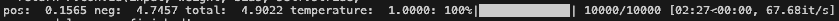
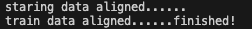
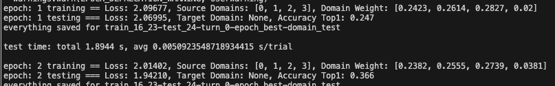

[toc]

# **Overview**

This README file provides a description of the code related to the paper “**Neural decoding algorithm for chronic brain-computer interface recording and its implementation in a neuromorphic chip**”.

We present **MANA (Manifold Alignment and unsupervised Network Adaptation)** — a computational algorithm designed to train ANNs or SNNs for accurate prediction of neural intentions in neuroprosthetic applications.

MANA supports supervised training followed by **continuous, label-free network adaptation**, enabling long-term decoding of time-varying neural signals across **multiple months** without manual re-labeling.

Using an ultra-fine electrode array, we recorded multi-unit activity from the **primary motor cortex (M1)** of a macaque monkey performing a well-trained reaching task. The recorded neural data was projected into a low-dimensional manifold space via contrastive learning-based ANNs. Then, across temporal segments, we applied **matrix decomposition and manifold alignment** to identify stable manifolds.

Finally, an **unsupervised adaptation strategy** continuously fine-tuned the decoder to compensate for neural signal drift, achieving robust intention decoding over extended time periods.

We evaluated the performance of MANA on BCI and AI tasks.

**Ps: To run this code, please download first and then run it in a Conda environment!**

# GY-reaching task

The long-term decoding experiment on the GYreaching task has data for 7 test days for demonstration. Other experiments have data for 1 test day for demonstration.

Before running, data must be unzipped using the following commands:

```bash
cd .../your_path/MANA-code
zip -s 0 GY-p2/zip/data.zip --out GY-p2/zip/data_.zip
unzip GY-p2/zip/data_.zip
```

## Long-term decoding

The command-line argument ``variable_num`` specifies the test day index. Its acceptable values are: 24, 25, 26, 28, 29, 31, and 36.

### MANA-ANN

Commands for running:

```bash
cd .../your_path/MANA-code
python GY-p2/long-term-decoding/MANA-ANN.py --variable_num XXX
```

The process of running .py file:

- Dimensionality reduction:
  
- Manifold alignment: (This process may take some time.)
  
- Supervised training and unsupervised adaptation:
  

**Parameter**

- mix_length

  - **This is a special parameter for MANA** and **can be customized**. The default value is 28.
  - You can modify it via command-line argument:

  ```bash
  python GY-p2/long-term-decoding/MANA-ANN.py --variable_num XXX --mix_length XXX
  ```

### MANA-SNN

Commands for running:

```bash
cd .../your_path/MANA-code
python GY-p2/long-term-decoding/MANA-SNN.py --variable_num XXX
```

It also has the ``--mix_length`` argument.

## Daily decoding

### MANA-ANN

Commands for running:

```bash
cd .../your_path/MANA-code
python GY-p2/daily-decoding/MANA-ANN.py
```

**Parameter**

- mix_length

  - **This is a special parameter for MANA** and **can be customized**. The default value is 28.
  - You can modify it via command-line argument:

  ```bash
  python GY-p2/daily-decoding/MANA-ANN.py --mix_length XXX
  ```

### MANA-SNN

Commands for running:

```bash
cd .../your_path/MANA-code
python GY-p2/daily-decoding/MANA-SNN.py
```

It also has the ``--mix_length`` argument.

## Using different numbers of training weeks

### MANA-ANN

Commands for running:

```bash
cd .../your_path/MANA-code
python GY-p2/training-weeks/MANA-ANN.py
```

**Parameter**

- train_weeks

  - This **controls the number of weeks used for training** and **can be set as [1, 2, 3, 4, 5]**. The default value is 4.
  - You can modify it via command-line argument:

  ```bash
  python GY-p2/training-weeks/MANA-ANN.py --train_weeks XXX
  ```

### MANA-SNN

Commands for running:

```bash
cd .../your_path/MANA-code
python GY-p2/training-weeks/MANA-SNN.py
```

It also has the ``--train_weeks`` argument.

## Single adaptation model

### MANA-ANN

Commands for running:

```bash
cd .../your_path/MANA-code
python GY-p2/AD-1-model/MANA-ANN.py
```

### MANA-SNN

Commands for running:

```bash
cd .../your_path/MANA-code
python GY-p2/AD-1-model/MANA-SNN.py
```

## Ablation experiments

### ANN-version

1. Only unsupervised adaptation (AD)
   ```bash
   cd .../your_path/MANA-code
   python GY-p2/CL-MA-AD/ANN/AD/AD-ANN.py
   ```
2. Dimensionality reduction and unsupervised adaptation (CL+AD)
   ```bash
   cd .../your_path/MANA-code
   python GY-p2/CL-MA-AD/ANN/CL-AD/CL-AD-ANN.py
   ```

### SNN-version

1. Only unsupervised adaptation (AD)
   ```bash
   cd .../your_path/MANA-code
   python GY-p2/CL-MA-AD/SNN/AD/AD-SNN.py
   ```
2. Dimensionality reduction and unsupervised adaptation (CL+AD)
   ```bash
   cd .../your_path/MANA-code
   python GY-p2/CL-MA-AD/SNN/CL-AD/CL-AD-SNN.py
   ```

# Jango task

## long-term-decoding

### MANA-ANN

Commands for running:

```bash
cd .../your_path/MANA-code
python Jango/long-term-decoding/MANA-ANN.py
```

**Parameter**

- variable_num

  - This **controls the day index used for testing** and **can be set as 6~20**. The default value is 6.
  - You can modify it via command-line argument:

  ```bash
  python Jango/long-term-decoding/MANA-ANN.py --variable_num XXX
  ```

### MANA-SNN

Commands for running:

```bash
cd .../your_path/MANA-code
python Jango/long-term-decoding/MANA-SNN.py
```

It also has the ``--variable_num`` argument.

# AI tasks

We evaluated the decoding accuracy on AI-assisted synthetic signals, using benchmark DvsGesture and MNIST datasets for simulating time-varying changes of signal distributions. By segmenting the DvsGesture dataset into temporal windows, we obtain time-varying distributions, with each window representing the data distribution over a one-week timespan. We used 1,000 images of the MNIST training set to form a data distribution to simulate a manifold in the latent space. Drift, the manifold (using digital number three for an example) undergoes a cyclical rightward drift along a latent temporal direction, incrementing by 2 units (here using pixel for measurement) per step. Rotation, each manifold is rotated counterclockwise in 15-degree increments around its center in the latent space, up to a total rotation of 180 degrees.

## Drift or Rotation or Dvegesture

Before running, data must be unzipped using the following commands:

```bash
cd .../your_path/MANA-code
zip -s 0 AI-tasks/zip/data.zip --out AI-tasks/zip/data_.zip
unzip AI-tasks/zip/data_.zip
```

### MANA-ANN

Commands for running:

```bash
cd .../your_path/MANA-code
python AI-tasks/drift/MANA-ANN/MANA-ANN.py
python AI-tasks/rotate/MANA-ANN/MANA-ANN.py
python AI-tasks/dvsgesture/MANA-ANN/MANA-ANN.py
```

**Parameter**

- variable

  - This parameter controls the simulated week for testing and **can be customized**.
  - For the 3 AI tasks, all data are provided. The acceptable range of variable is 5~12. You can modify it via command-line argument:

  ```bash
  python AI-tasks/.../MANA-ANN/MANA-ANN.py --variable XXX
  ```

### MANA-SNN

Commands for running:

```bash
cd .../your_path/MANA-code
python AI-tasks/drift/MANA-SNN/MANA-SNN.py
python AI-tasks/rotate/MANA-SNN/MANA-SNN.py
python AI-tasks/dvsgesture/MANA-SNN/MANA-SNN.py
```

It also has the ``--variable`` argument.

# Plotting figures

Because the data required to generate Fig.3b、c、d is too large to upload to GitHub, it is provided via Google Drive instead (**https://drive.google.com/drive/folders/1bUp7f4ajYvDBFQuwpgaul8c0koIb-FeN?usp=sharing**). Please download the Fig3bcd folder and place it under ``your_path/MANA-figures/data/``

Commands for running:

```bash
cd .../your_path/MANA-figures
python FigXX.py
```

You will find individual **.py** scripts corresponding to each figure.
